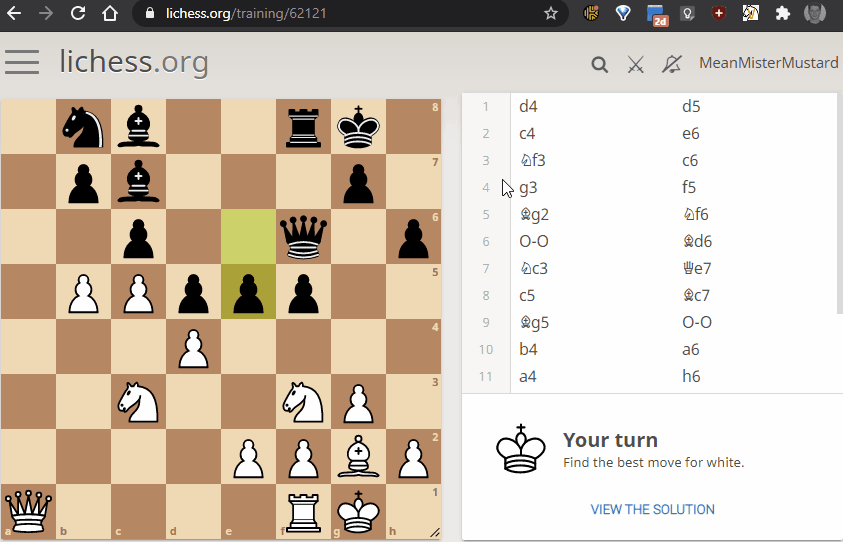

## Damn Puzzle! [(get it here)]()
_See the Lichess.org user vote of a tactics puzzle before wasting time on it._

### How it works.

Whenever you request a tactics puzzle from [lichess.org](https://lichess.org/training/), it automatically sends you 
the user vote on that puzzle. However, for some reason the website only shows you this information if you are logged in
 and after you have completed the puzzle. This of course can be very annoying and thus this browser extension allows you
 to view the rating before wasting time.